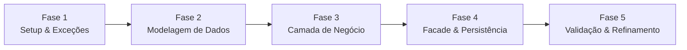
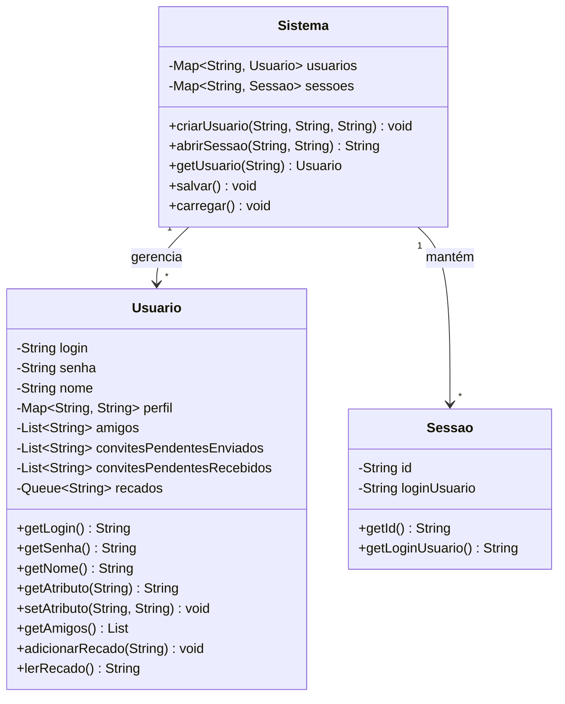

# Plano de Implementação — Rede de Relacionamentos Jackut (Milestone 1)

## Escopo Técnico

### O que será construído

O **Jackut** é uma rede de relacionamentos (inspirada no Orkut) implementada exclusivamente como lógica de negócio, **sem interface gráfica**. O sistema é validado por testes de aceitação automatizados via biblioteca [EasyAccept](file:///c:/Users/guinwv/Projetos/bootstrap-P2-2023.1-JACKUT/P2-2023.1-JACKUT/lib/easyaccept.jar), que invoca métodos na classe [Facade](file:///c:/Users/guinwv/Projetos/bootstrap-P2-2023.1-JACKUT/P2-2023.1-JACKUT/src/br/ufal/ic/p2/jackut/Facade.java) através de scripts de teste.

O **Milestone 1** cobre as **User Stories 1 a 4**:

| US | Título | Descrição |
|----|--------|-----------|
| 1 | Criação de conta | Cadastro com login, senha e nome. Login único. |
| 2 | Criação/Edição de perfil | Atributos dinâmicos (mapa chave-valor). |
| 3 | Adição de amigos | Convite bidirecional — só efetiva quando mútuo. |
| 4 | Envio de recados | Fila FIFO de mensagens entre usuários. |

### Stack Tecnológica Identificada

| Componente | Tecnologia |
|------------|-----------|
| Linguagem | Java (JDK 20, compatível com 1.5+) |
| Framework de testes | EasyAccept (`lib/easyaccept.jar`) |
| IDE | IntelliJ IDEA |
| Persistência | Arquivo (serialização Java — `encerrarSistema` grava, inicialização restaura) |
| Build | Compilação via IntelliJ (sem Maven/Gradle) |
| Pacote base | `br.ufal.ic.p2.jackut` |

---

## Fases de Implementação



---

## Fase 1 — Setup Inicial e Hierarquia de Exceções

**Objetivo:** Estabelecer a estrutura de pacotes e as exceções customizadas que o EasyAccept espera como mensagens de erro exatas.

> [!IMPORTANT]
> As mensagens de erro devem ser **idênticas** às esperadas nos testes. Um caractere diferente faz o teste falhar. As mensagens foram extraídas diretamente dos scripts `us*.txt`.

### Tarefas

| # | Tarefa | Arquivo | Depende de |
|---|--------|---------|-----------|
| 1.1 | Criar pacote de exceções | `src/br/ufal/ic/p2/jackut/exceptions/` (diretório) | — |
| 1.2 | Exceção: login duplicado | `src/br/ufal/ic/p2/jackut/exceptions/ContaJaExisteException.java` | 1.1 |
| 1.3 | Exceção: login inválido | `src/br/ufal/ic/p2/jackut/exceptions/LoginInvalidoException.java` | 1.1 |
| 1.4 | Exceção: senha inválida | `src/br/ufal/ic/p2/jackut/exceptions/SenhaInvalidaException.java` | 1.1 |
| 1.5 | Exceção: login ou senha incorretos | `src/br/ufal/ic/p2/jackut/exceptions/LoginOuSenhaInvalidosException.java` | 1.1 |
| 1.6 | Exceção: usuário não cadastrado | `src/br/ufal/ic/p2/jackut/exceptions/UsuarioNaoCadastradoException.java` | 1.1 |
| 1.7 | Exceção: atributo não preenchido | `src/br/ufal/ic/p2/jackut/exceptions/AtributoNaoPreenchidoException.java` | 1.1 |
| 1.8 | Exceção: já adicionado como amigo | `src/br/ufal/ic/p2/jackut/exceptions/UsuarioJaAmigoException.java` | 1.1 |
| 1.9 | Exceção: aguardando aceitação | `src/br/ufal/ic/p2/jackut/exceptions/ConvitePendenteException.java` | 1.1 |
| 1.10 | Exceção: adicionar a si mesmo | `src/br/ufal/ic/p2/jackut/exceptions/AutoAmizadeException.java` | 1.1 |
| 1.11 | Exceção: não há recados | `src/br/ufal/ic/p2/jackut/exceptions/SemRecadosException.java` | 1.1 |
| 1.12 | Exceção: enviar recado a si mesmo | `src/br/ufal/ic/p2/jackut/exceptions/AutoRecadoException.java` | 1.1 |

### Mensagens de Erro Exatas (extraídas dos testes)

```
"Conta com esse nome já existe."          → ContaJaExisteException
"Login inválido."                          → LoginInvalidoException
"Senha inválida."                          → SenhaInvalidaException
"Login ou senha inválidos."                → LoginOuSenhaInvalidosException
"Usuário não cadastrado."                  → UsuarioNaoCadastradoException
"Atributo não preenchido."                 → AtributoNaoPreenchidoException
"Usuário já está adicionado como amigo."   → UsuarioJaAmigoException
"Usuário já está adicionado como amigo, esperando aceitação do convite." → ConvitePendenteException
"Usuário não pode adicionar a si mesmo como amigo." → AutoAmizadeException
"Não há recados."                          → SemRecadosException
"Usuário não pode enviar recado para si mesmo." → AutoRecadoException
```

> [!WARNING]
> O EasyAccept captura a mensagem da exceção via `getMessage()`. Todas as exceções devem estender `RuntimeException` (ou `Exception`) e passar a mensagem exata no construtor `super(mensagem)`.

---

## Fase 2 — Modelagem de Dados (Entidades de Domínio)

**Objetivo:** Criar as classes que representam as entidades centrais do sistema.

### Modelo de Dados Conceitual



### Tarefas

| # | Tarefa | Arquivo | Depende de |
|---|--------|---------|-----------|
| 2.1 | Criar classe `Usuario` | `src/br/ufal/ic/p2/jackut/models/Usuario.java` | Fase 1 |
| 2.2 | Criar classe `Sistema` (gerenciador central) | `src/br/ufal/ic/p2/jackut/models/Sistema.java` | 2.1 |

### Decisões de Design — Classe `Usuario`

- **Perfil como `Map<String, String>`:** Os testes mostram que os atributos do perfil são dinâmicos (o usuário pode inventar novos). O atributo `nome` é especial — faz parte da conta, mas também é acessível via `getAtributoUsuario`.
- **Amizade como convite bidirecional:**
  - Quando A adiciona B: B é adicionado a `convitesPendentesEnviados` de A, e A é adicionado a `convitesPendentesRecebidos` de B.
  - Quando B adiciona A: se A está em `convitesPendentesRecebidos` de B, a amizade é efetivada em ambas as listas de `amigos`.
- **Recados como `Queue<String>` (FIFO):** `lerRecado` retorna e remove o primeiro da fila.
- **Serialização:** A classe deve implementar `java.io.Serializable`.

### Decisões de Design — Classe `Sistema`

- **`Map<String, Usuario>`** indexado por login para acesso O(1).
- **`Map<String, Sessao>`** indexado por ID da sessão. O ID pode ser gerado como `login + "_sessao"` ou um UUID simples.
- Responsável por serializar/deserializar o estado completo.

---

## Fase 3 — Camada de Negócio (Regras e Validações)

**Objetivo:** Implementar toda a lógica de negócio dentro da classe `Sistema`, com as validações e regras extraídas dos testes.

### Tarefas

| # | Tarefa | Arquivo | Depende de |
|---|--------|---------|-----------|
| 3.1 | Implementar `criarUsuario(login, senha, nome)` | `Sistema.java` | 2.2 |
| 3.2 | Implementar `abrirSessao(login, senha)` | `Sistema.java` | 2.2 |
| 3.3 | Implementar `getAtributoUsuario(login, atributo)` | `Sistema.java` | 2.2 |
| 3.4 | Implementar `editarPerfil(idSessao, atributo, valor)` | `Sistema.java` | 3.2 |
| 3.5 | Implementar `adicionarAmigo(idSessao, amigo)` | `Sistema.java` | 3.2 |
| 3.6 | Implementar `ehAmigo(login, amigo)` | `Sistema.java` | 2.1 |
| 3.7 | Implementar `getAmigos(login)` | `Sistema.java` | 2.1 |
| 3.8 | Implementar `enviarRecado(idSessao, destinatario, mensagem)` | `Sistema.java` | 3.2 |
| 3.9 | Implementar `lerRecado(idSessao)` | `Sistema.java` | 3.2 |
| 3.10 | Implementar `zerarSistema()` | `Sistema.java` | 2.2 |
| 3.11 | Implementar `encerrarSistema()` (persistência) | `Sistema.java` | 2.2 |

### Regras de Negócio Detalhadas (extraídas dos testes)

#### US1 — Criação de Conta (`criarUsuario`)

| Regra | Evidência no teste |
|-------|-------------------|
| Login vazio/nulo → `"Login inválido."` | `us1_1.txt` linha 35 |
| Senha vazia/nula → `"Senha inválida."` | `us1_1.txt` linha 36 |
| Login já existente → `"Conta com esse nome já existe."` | `us1_1.txt` linha 26 |
| Nome vazio é permitido | `us1_1.txt` linha 38 |

#### US1 — Abertura de Sessão (`abrirSessao`)

| Regra | Evidência no teste |
|-------|-------------------|
| Login ou senha incorretos → `"Login ou senha inválidos."` | `us1_1.txt` linhas 47-50 |
| Login vazio → `"Login ou senha inválidos."` | `us1_1.txt` linha 49 |
| Senha vazia → `"Login ou senha inválidos."` | `us1_1.txt` linha 50 |
| Retorna um ID de sessão | `us2_1.txt` linha `id1=abrirSessao ...` |

#### US2 — Perfil (`editarPerfil`, `getAtributoUsuario`)

| Regra | Evidência no teste |
|-------|-------------------|
| Editar sem sessão válida → `"Usuário não cadastrado."` | `us2_1.txt` linha 7 |
| Atributo não preenchido → `"Atributo não preenchido."` | `us2_1.txt` linhas 13-22 |
| Usuário não cadastrado → `"Usuário não cadastrado."` | `us1_1.txt` linha 7 |
| Atributo `nome` é retornado como atributo do perfil | `us2_1.txt` linha 33 |
| Atributos podem ser qualquer string arbitrária | Evidência: testes usam vários nomes |

#### US3 — Amizade (`adicionarAmigo`, `ehAmigo`, `getAmigos`)

| Regra | Evidência no teste |
|-------|-------------------|
| Convite unilateral → `ehAmigo` retorna `false` | `us3_1.txt` linhas 16-17 |
| Convite mútuo → `ehAmigo` retorna `true` para ambos | `us3_1.txt` linhas 22-23 |
| Adicionar novamente enquanto pendente → `"Usuário já está adicionado como amigo, esperando aceitação do convite."` | `us3_1.txt` linha 15 |
| Adicionar novamente se já amigos → `"Usuário já está adicionado como amigo."` | `us3_1.txt` linha 55 |
| Usuário não cadastrado (destino) → `"Usuário não cadastrado."` | `us3_1.txt` linha 58 |
| Sessão inválida (remetente) → `"Usuário não cadastrado."` | `us3_1.txt` linha 59 |
| Adicionar a si mesmo → `"Usuário não pode adicionar a si mesmo como amigo."` | `us3_1.txt` linha 61 |
| `getAmigos` retorna formato `{login1,login2}` | `us3_1.txt` linhas 25-26 |
| Lista vazia retorna `{}` | `us3_1.txt` linha 40 |
| Ordem de inserção mantida na lista de amigos | `us3_1.txt` linhas 49-51 |

#### US4 — Recados (`enviarRecado`, `lerRecado`)

| Regra | Evidência no teste |
|-------|-------------------|
| Destinatário não cadastrado → `"Usuário não cadastrado."` | `us4_1.txt` linha 9 |
| Recados lidos em ordem FIFO | `us4_1.txt` linhas 26-31 |
| Fila vazia → `"Não há recados."` | `us4_1.txt` linhas 33-34 |
| Enviar para si mesmo → `"Usuário não pode enviar recado para si mesmo."` | `us4_1.txt` linha 47 |
| Recados de diferentes remetentes mantêm ordem de chegada | `us4_1.txt` linhas 39-42 |

---

## Fase 4 — Facade e Persistência

**Objetivo:** Implementar a Facade que expõe os métodos para o EasyAccept e o mecanismo de gravação/recuperação de dados.

### Tarefas

| # | Tarefa | Arquivo | Depende de |
|---|--------|---------|-----------|
| 4.1 | Implementar todos os métodos na Facade | `src/br/ufal/ic/p2/jackut/Facade.java` | Fase 3 |
| 4.2 | Implementar persistência (serialização Java) | `Sistema.java` + `Facade.java` | 3.11 |

### Contrato da Facade (12 métodos)

A Facade é o ponto de entrada do EasyAccept. Cada método da linguagem de script corresponde a um método público na Facade:

```
zerarSistema()                                                → void
criarUsuario(String login, String senha, String nome)          → void
abrirSessao(String login, String senha)                        → String (id)
getAtributoUsuario(String login, String atributo)              → String
editarPerfil(String id, String atributo, String valor)         → void
adicionarAmigo(String id, String amigo)                        → void
ehAmigo(String login, String amigo)                            → boolean
getAmigos(String login)                                        → String (formato {a,b,c})
enviarRecado(String id, String destinatario, String recado)    → void
lerRecado(String id)                                           → String
encerrarSistema()                                              → void
```

> [!IMPORTANT]
> O parâmetro `recado` no teste `us4_1.txt` é escrito como `recado=`, mas na especificação do `resumo.md` o campo é chamado `mensagem`. Nos testes reais, o EasyAccept faz matching por nome de parâmetro. **O nome do parâmetro no método da Facade deve ser `recado`**, conforme usado nos scripts de teste (linha `enviarRecado id=${id1} destinatario=oabath recado="Ola!"`).

### Estratégia de Persistência

- **Formato:** Serialização Java (`ObjectOutputStream`/`ObjectInputStream`)
- **Arquivo:** `dados.dat` (ou similar) na raiz do projeto
- **`encerrarSistema()`:** Serializa o `Map<String, Usuario>` para arquivo
- **Inicialização da Facade (construtor):** Tenta carregar o arquivo; se não existir, inicia vazio
- **`zerarSistema()`:** Limpa todos os dados EM MEMÓRIA e também deleta o arquivo de persistência

> [!NOTE]
> Os testes `us*_2.txt` são **testes de persistência**. Eles são executados logo após os `us*_1.txt` sem chamar `zerarSistema` primeiro, verificando que os dados sobrevivem entre execuções. A ordem de execução é definida em [Main.java](file:///c:/Users/guinwv/Projetos/bootstrap-P2-2023.1-JACKUT/P2-2023.1-JACKUT/src/Main.java#L5-L10).

---

## Fase 5 — Validação e Refinamento

**Objetivo:** Executar todos os testes de aceitação e corrigir falhas.

### Tarefas

| # | Tarefa | Arquivo | Depende de |
|---|--------|---------|-----------|
| 5.1 | Executar `Main.java` e verificar testes US1 | — | Fase 4 |
| 5.2 | Executar e verificar testes US2 | — | 5.1 |
| 5.3 | Executar e verificar testes US3 | — | 5.2 |
| 5.4 | Executar e verificar testes US4 | — | 5.3 |
| 5.5 | Corrigir falhas encontradas (iterativo) | Classes afetadas | 5.1–5.4 |
| 5.6 | Adicionar Javadoc completo a todas as classes | Todas as classes | 5.5 |

### Plano de Verificação

- **Automatizado:** Executar `Main.java` que roda todos os 8 scripts de teste (`us1_1.txt` até `us4_2.txt`) via EasyAccept
- **Manual:** Revisão visual do output do EasyAccept para garantir 0 falhas

---

## Mapa de Arquivos (Visão Consolidada)

### Arquivos a CRIAR

| Caminho | Fase |
|---------|------|
| `src/br/ufal/ic/p2/jackut/exceptions/ContaJaExisteException.java` | 1 |
| `src/br/ufal/ic/p2/jackut/exceptions/LoginInvalidoException.java` | 1 |
| `src/br/ufal/ic/p2/jackut/exceptions/SenhaInvalidaException.java` | 1 |
| `src/br/ufal/ic/p2/jackut/exceptions/LoginOuSenhaInvalidosException.java` | 1 |
| `src/br/ufal/ic/p2/jackut/exceptions/UsuarioNaoCadastradoException.java` | 1 |
| `src/br/ufal/ic/p2/jackut/exceptions/AtributoNaoPreenchidoException.java` | 1 |
| `src/br/ufal/ic/p2/jackut/exceptions/UsuarioJaAmigoException.java` | 1 |
| `src/br/ufal/ic/p2/jackut/exceptions/ConvitePendenteException.java` | 1 |
| `src/br/ufal/ic/p2/jackut/exceptions/AutoAmizadeException.java` | 1 |
| `src/br/ufal/ic/p2/jackut/exceptions/SemRecadosException.java` | 1 |
| `src/br/ufal/ic/p2/jackut/exceptions/AutoRecadoException.java` | 1 |
| `src/br/ufal/ic/p2/jackut/models/Usuario.java` | 2 |
| `src/br/ufal/ic/p2/jackut/models/Sistema.java` | 2–3 |

### Arquivos a MODIFICAR

| Caminho | Fase | Modificação |
|---------|------|-------------|
| `src/br/ufal/ic/p2/jackut/Facade.java` | 4 | Adicionar os 12 métodos públicos, instanciar `Sistema` |
| `src/Main.java` | — | Já está pronto, sem alterações necessárias |

---

## Pontos de Atenção

### 1. Encoding de Caracteres (ISO 8859-1)

> [!WARNING]
> Os scripts de teste usam codificação **ISO 8859-1** (comentário explícito em `us1_1.txt` linha 6). As mensagens de erro contêm acentos (ex: `"Usuário não cadastrado."`). Certifique-se de que:
> - Os arquivos `.java` são salvos em **UTF-8**
> - As strings de mensagem sejam escritas normalmente em UTF-8 no código Java
> - O EasyAccept consiga fazer o matching (pode requerer ajuste de encoding na JVM: `-Dfile.encoding=ISO-8859-1`)

### 2. Formato de Retorno de `getAmigos`

O teste espera o formato `{login1,login2}` — chaves sem espaços, nomes separados por vírgula. Exemplo: `{oabath,jdoe}`. Lista vazia: `{}`.

### 3. Geração de ID de Sessão

Os testes atribuem o retorno de `abrirSessao` a variáveis (`id1=abrirSessao ...`). O ID precisa ser único e determinístico o suficiente para o EasyAccept rastrear. Sugestão: usar o próprio `login` como ID (simples e funcional, já que o EasyAccept não impõe formato).

### 4. Persistência entre Scripts

O EasyAccept executa os scripts na ordem definida em `Main.java`. Os scripts `_2.txt` **não** chamam `zerarSistema` — eles verificam que os dados do `_1.txt` foram persistidos. Isso exige que `encerrarSistema()` no final de cada `_1.txt` grave em arquivo, e que o construtor da Facade carregue esse arquivo automaticamente.

### 5. Sessões e Estado Transiente

As sessões (`abrirSessao`) são **transientes** — não devem ser persistidas. Cada execução de script começa sem sessões ativas. Os testes `_2.txt` abrem novas sessões quando necessário.

### 6. Ausência de Build Tool

O projeto não possui `build.xml`, `pom.xml` ou `build.gradle`. A compilação é feita pelo IntelliJ IDEA. Considere criar um `build.xml` simples para facilitar execução em linha de comando se necessário.

### 7. Milestones Futuros (US5–US9)

O código deve ser projetado com extensibilidade em mente. As User Stories 5–9 (comunidades, mensagens de comunidade, novos relacionamentos, remoção de conta) serão adicionadas em milestones futuros. Decisões de design que facilitam extensão:
- Usar interfaces/abstrações para tipos de relacionamento (preparação para US8)
- Manter separação clara entre camadas (Facade → Sistema → Entidades)

---

## Open Questions

> [!IMPORTANT]
> **Nenhuma lacuna crítica foi encontrada.** A documentação (`resumo.md`) combinada com os testes de aceitação fornece cobertura completa dos requisitos para o Milestone 1. Entretanto, as seguintes decisões de design pedem validação:

1. **Estrutura de pacotes:** O plano propõe subpacotes `models/` e `exceptions/`. Você prefere essa organização ou colocar tudo diretamente em `br.ufal.ic.p2.jackut`?

2. **Persistência via Serialização Java (`Serializable`)**: É a abordagem mais simples e alinhada com o escopo. Alternativas seriam JSON ou XML, mas adicionam complexidade sem benefício claro. Concorda?

3. **Cobertura do milestone:** Deseja que o plano também inclua a geração do relatório de design (`relatorio-milestone1`) e do diagrama de classes, ou apenas a implementação do código?
